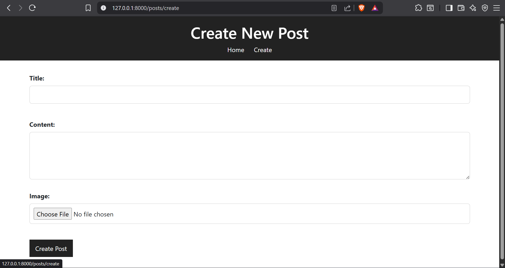

## About project

Simple blog project made of laravel framework and simple html and css

## Features

1- Create Posts
2- Upload Images For Posts
3- Show Any Post You Write

## Technologies User

1- Laravel 12
2- MySQL
3- bootstrap
4- HTML
5- CSS

## Pics Of Project

### Home Page

### Post Page

### Create Page

### Using Pagination
