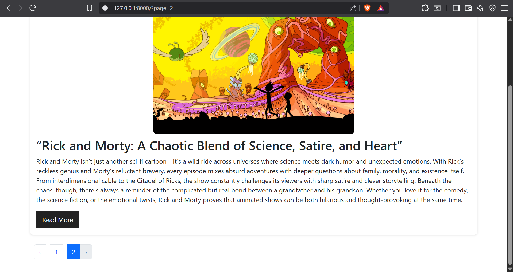

## About project

Simple blog project made of laravel framework and simple html and css

## Features

1- Create Posts 
2- Upload Images For Posts 
3- Show Any Post You Write 

## Technologies User

1- Laravel 12 
2- MySQL 
3- bootstrap 
4- HTML 
5- CSS 

## Pics Of Project

### Home Page

### Post Page

### Create Page

### Using Pagination

## Installation & Run

### Clone the repository
git clone https://github.com/Devazhary/Simple_Blog.git
cd Simple_Blog